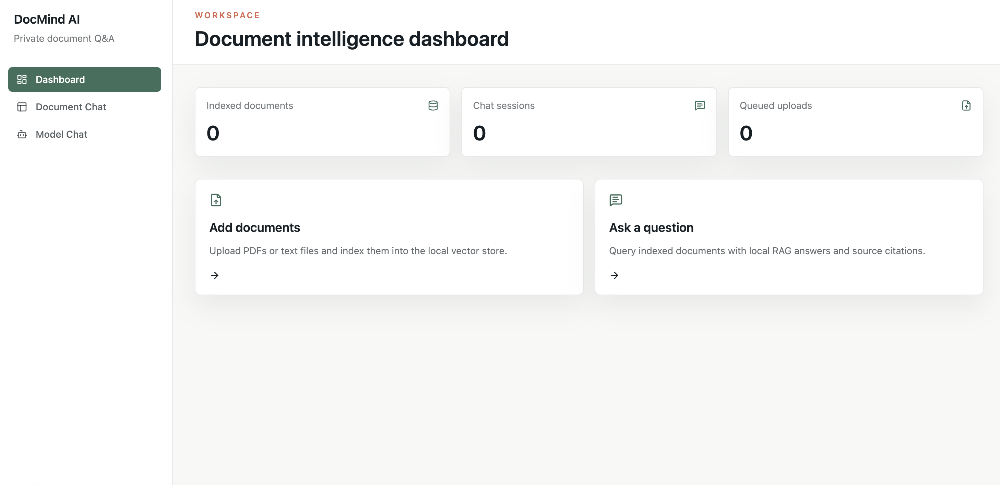

# DocMind AI

DocMind AI is a local-first app for chatting with your documents. Upload PDF or TXT files, index them locally, and ask questions in one place.

## Preview



## What It Does

- Upload PDF and TXT files
- Extract and chunk document text
- Create embeddings with Ollama
- Store data in ChromaDB locally
- Chat with your documents
- Chat directly with the Ollama model
- Keep uploads and chat history on your machine

## Tech Stack

- Backend: FastAPI, Uvicorn, Pydantic, ChromaDB, Ollama
- Frontend: React, Vite, Tailwind CSS, React Router
- Storage: local uploads, local Chroma persistence, local chat session files

## Quick Start

### Backend

```bash
cd backend
uv sync
uv run uvicorn app.main:app --reload --host 127.0.0.1 --port 8000
```

### Frontend

```bash
cd frontend
pnpm install
pnpm dev
```

## Requirements

- Python 3.11+
- Node.js 22.12+ or 20.19+
- pnpm
- uv
- Ollama running locally

## Default Models

- Chat model: `qwen3.5`
- Embedding model: `qwen3-embedding`

## Main Screens

- Dashboard
- Document Chat
- Model Chat

## Notes

- The app is designed to run locally and keep data on your machine.
- Scanned PDFs without selectable text may not index correctly.
- If you change the backend port, update the frontend proxy settings too.

