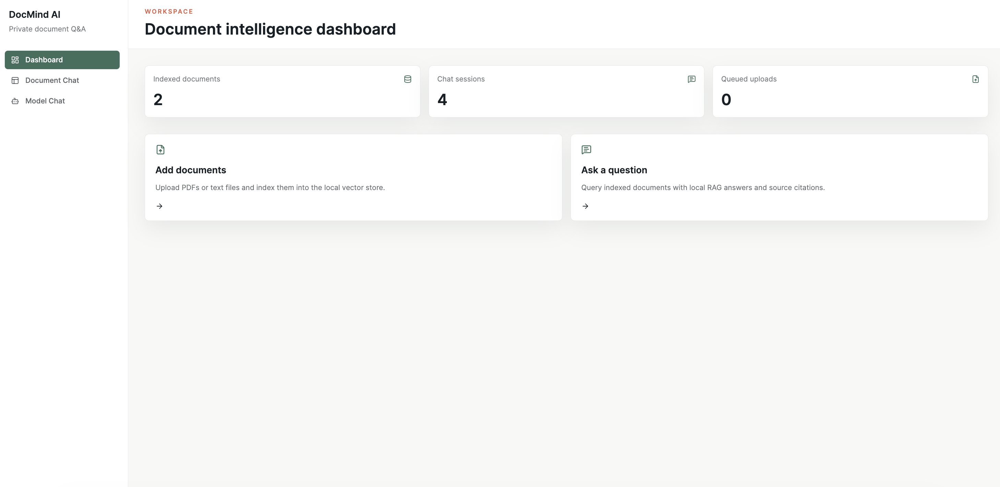
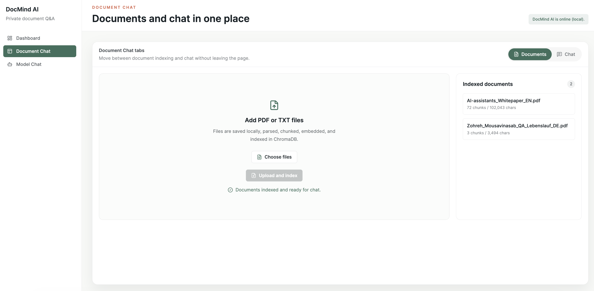
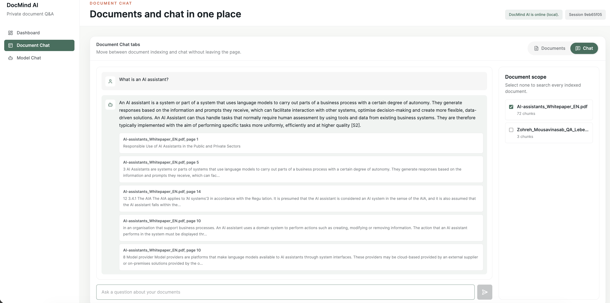

# DocMind AI

DocMind AI is a local-first document Q&A app. It helps you upload PDFs or TXT files, index them locally, and ask questions with grounded answers and source references.

## Preview

### Dashboard



### Document Chat



### Model Chat



## What It Does

- Show a document intelligence dashboard with indexed document counts, chat session counts, and queued uploads
- Upload PDF and TXT files and index them into a local vector store
- Parse, chunk, and embed document text with Ollama
- Store embeddings in ChromaDB on your machine
- Ask questions against indexed documents with source citations
- Switch between document ingestion and chat without leaving the workspace
- Chat directly with the configured Ollama model
- Keep uploads, document state, and chat history local

## Tech Stack

- Backend: FastAPI, Uvicorn, Pydantic, ChromaDB, Ollama
- Frontend: React, Vite, Tailwind CSS, React Router
- Storage: local uploads, local Chroma persistence, local chat session files

## Quick Start

### Backend

```bash
cd backend
uv sync
uv run uvicorn app.main:app --reload --host 127.0.0.1 --port 8000
```

### Frontend

```bash
cd frontend
pnpm install
pnpm dev
```

## Requirements

- Python 3.11+
- Node.js 22.12+ or 20.19+
- pnpm
- uv
- Ollama running locally

## Default Models

- Chat model: `qwen3.5`
- Embedding model: `qwen3-embedding`

## Main Screens

- Dashboard: overview cards and quick actions for adding documents or asking questions
- Document Chat: a split workspace for document uploads, indexed sources, and RAG chat
- Model Chat: direct chat with the local Ollama model

## Notes

- The app is designed to run locally and keep data on your machine.
- Scanned PDFs without selectable text may not index correctly.
- If you change the backend port, update the frontend proxy settings too.
